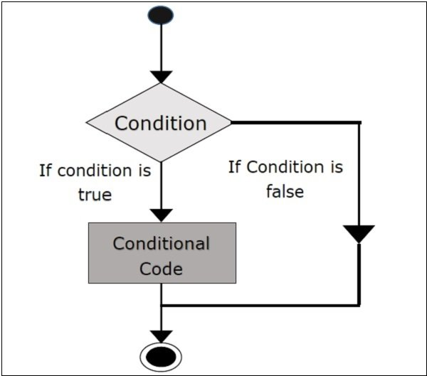
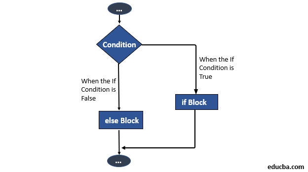
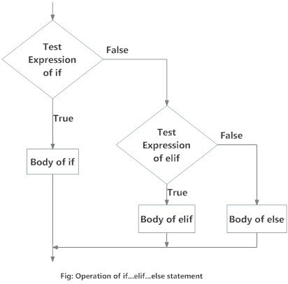
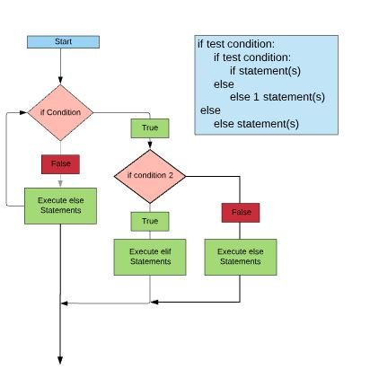

### Decision Making: [Condition Statement/ Control Structures]
> Decision making in the anticipation of conditions occuring during the execution of a program and specified action taken according to the conditions.
> Python programming language provides the following Decision Control Statements are:

>- 1) if 
>- 2) if-else
>- 3) if-elif-else
>- 4) nested if

#### if statement:
>> The if statement contains a logical expression using which the data is compared and a decision is made based on the result of the comparision.
###### Syntax: 
      if(expression):
        statement(s)
      # Note: In python statements in a block are uniformly indented after : symbol.

##### Flow Diagram:

      # Example:
      a = int(input("Enter a value: "))
      b = int(input("Enter b value: "))
      if(a>b):
        print("Inside of if-block")
        print(f"Largest element is: {a}")
      print("Outside of if-block")

      ''' output: 
      Enter a value: 5
      Enter b value: 2
      Inside of if-block
      Largest element is: 5
      Outside of if-block
      '''
    

#### if-else statement: 
> An else statement can be combined with an if-statement. An else statement contains a block of code that executes if the conditional expression in the if-statement resolves to 0 or a False value.
###### Syntax:
      if(expression):
        statement(s)
      else:
        statement(s)

##### Flow Diagram:

      # Example:
      a = int(input("Enter a value: "))
      b = int(input("Enter b value: "))
      if(a > b):
        print("Inside of if-block")
        print(f"Largest element is: {a}")
      else: 
        print("Inside of else-block")
        print(f"Largest element is: {b}")
      print("Outside of if-else-block")

      ''' Output:
        Enter a value: 5
        Enter b value: 2
        Inside of if-block
        Largest element is: 5
        Outside of if-else-block
        
        Enter a value: 2
        Enter b value: 4
        Inside of else-block 
        Largest element is: 4
        Outside of if-else-block
      '''

#### if-elif-else-statement:
> The elif statement allows you to check multiple expressions for True and execute a block of code as soon as one of the condition evaluates to True.
###### Syntax:
    if(expression1):
      statement(s)
    elif (expression2):
      statement(s)
    elif (expression3):
      statement(s)
    else:
      statement(s)

##### Flow Diagram:

    # Example:
    hours = int(input("Enter time in hours: "))
    if(hours>=6 and hours<12):
      print("Good Morning :)")
    elif (hours>=12 and hours<16):
      print("Good Afternoon :)")
    elif (hours>=16 and hours<19):
      print("Good Evening :)")
    else:
      print("Good Night :>")
      
    ''' Output:
    Enter time in hours: 15
    Good Afternoon :)
    '''

#### nested-if statement:
> Nested if statements are an if statement inside another if statement.
###### Syntax:
      if(expression):
        if(expression):
          statement(s)
      else:
        statement(s)

##### Flow Diagram:

      # Example:
      a = 5
      b = 10
      c = 15
      if a > b:
        if a > c:
            print("a value is big")
        else:
            print("c value is big")
      elif b > c:
          print("b value is big")
      else:
          print("c is big")
      
      # output: c is big
  
##### Single Statement Suites:
> If the suits if an if clause consists only of a single line, it may go on the same line as the header statement.

      # Example:
      num1 = int(input("Enter first number 1: "))
      num2 = int(input("Enter second number 2: "))

      if(num1 > num2): print(f'{num1} is greatest number')
      else: print(f"{num2} is greatest number")

      ''' Output:
      Enter first number 1: 5
      Enter second number 2: 2
      5 is greatest number
      '''
