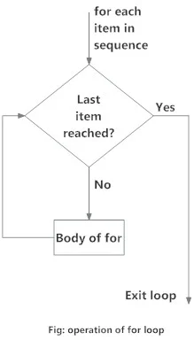

### Iteration Constructors/ Loops:
> A loop statement allows us to execute a statement or group if statements multiple times.
> Python programming language provides the following types of loops:

>- 1) while loop
>- 2) for loop
>- 3) Nested loops

#### while loop statement:
> A while loop statement in Python programming language repeatedly executes a target statement as long as a given condition is True.
###### Syntax: 
      while(expression):
        statement(s)

##### Flow Diagram:

> Here, statement(s) may be a single statement or a block of statements with uniform indent. The condition may be any expression and True is any non-zero value. The loop iterates while the condition is True.
> When the condition becomes False, program control passes to the time immediately following the loop.

      # Example:
      n = int(input("Enter a number: "))
      fact = 1
      i = 1
      while(i<=n):
        fact = fact*i
        i = i+1
      print(f"Factorial of given number is {fact}")

      ''' Output:
      Enter a number: 12
      Factorial of given number is 479001600
      '''

#### for loop statement:
> The for statement in Python has the ability to be iterative over the times of any sequence, such as a list or a string.
###### Syntax: 
      for iterating_variable in sequence:
        statement(s)

> If a sequence contains an expression list, it is evaluated first. Then, the first item in the sequence is assigned to the iterating variable. Next, the statements block is executed. Each item in the list is assigned to iterating variable and the statements block is executed until the entire. Sequence is exhausted.

##### Flow Diagram:

      # Example:
      a_list = [10, 20, 30]
      for item in a_list:
        print(item)

      ''' Output:
      10
      20
      30
      '''

> The  built-in range() function is the right function to iterate or a sequence of numbers. range() generates an iterator to progress integers starting with 0 upto n-1.

###### range() function syntax:
      '''
      1) range(stop):
      stop: number of integers to generate, starting from zero.

      2) range([start], stop, [, step]):
      start: starting number of the sequence
      stop: generate numbers upto, but not including this number.
      stop: difference between each number in the sequence  
      '''

      # Example: 
      data = [10, 20, 30, 40]
      for item in range(0, len(data)):
        print(data[item])

      ''' Output:
      10
      20
      30
      40
      '''
  
#### Using else statement with loops:
> Python supports having an else statement associated with a loop statement.

> If the else statement is used with a for-loop, the else block is executed only if for loops terminates normally ( and not by encountering break statement).

> If th else statement is used with a while loop, the else statement is executed when the condition becomes false.

      # Example:
      for var in range(1, 11):
        print(var, end=' ')
      else: 
        print("else block")

      ''' Output:
      1 2 3 4 5 6 7 8 9 10 else block
      '''

      # Example:
      for var in range(1, 11):
        if(var==5):
          break
        print(var, end=' ')
      else: 
        print("else block")
        
      ''' Output:
      1 2 3 4
      '''

> The else code will never be executed as in the if-block of for-loop consists of a break statement which then forcefully terminates the loop.

#### nested loop statement:
> Python programming language allows the use of one loop inside another loop.
###### nested for loop syntax:
      for iterating_variable1 in sequence1:
        for iterating_variable2 in sequence2:
          statement(s)

###### nested while loop syntax:
      while(expression1):
        while(expression2):
          statement(s)
        statement(s)

  

      # Example:
      for iterating_variable1 in range(0, 3):
        for iterating_variable2 in range(0, 2):
          print((iterating_variable1, iterating_variable2))

      ''' Output:
      (0, 0)
      (0, 1)
      (1, 0)
      (1, 1)
      (2, 0)
      (2, 1)
      '''

#### Loop control statements:
> The loop control statements change the execution from its normal sequence.

> Python supports the following control statements:
>- 1) break statement
>- 2) continue statement
>- 3) pass statement

#### break statement:
> The break statement terminates the loop statements, and transfers execution to the statement immediately the loop.

      # Example:
      for letter in 'Python':
        if(letter =='h'):
          break
        print(f"current letter: {letter}")

      ''' Output:
      current letter: P
      current letter: y
      current letter: t
      '''

#### continue statement:
> The continue statement causes the loop to skip the remainder of it's body and immediately retest it's condition prior to reiterating.

      # Example:
      for letter in 'Python':
        if(letter =='h'):
          continue
        print(f"current letter: {letter}")

      ''' Output:
      current letter: P
      current letter: y
      current letter: t
      current letter: o
      current letter: n
      '''

#### pass statement:
> The pass statement is a null operation; nothing happens when it executes.
> The pass statement is also useful in places where your code will eventually go, but has not been written yet.

      # Example:
      for letter in 'Python':
        if(letter =='h'):
          pass
          print("This is a pass block")
        print(f"current letter: {letter}")

      ''' Output:
      current letter: P
      current letter: y
      current letter: t
      This is a pass block
      current letter: h
      current letter: o
      current letter: n
      '''
